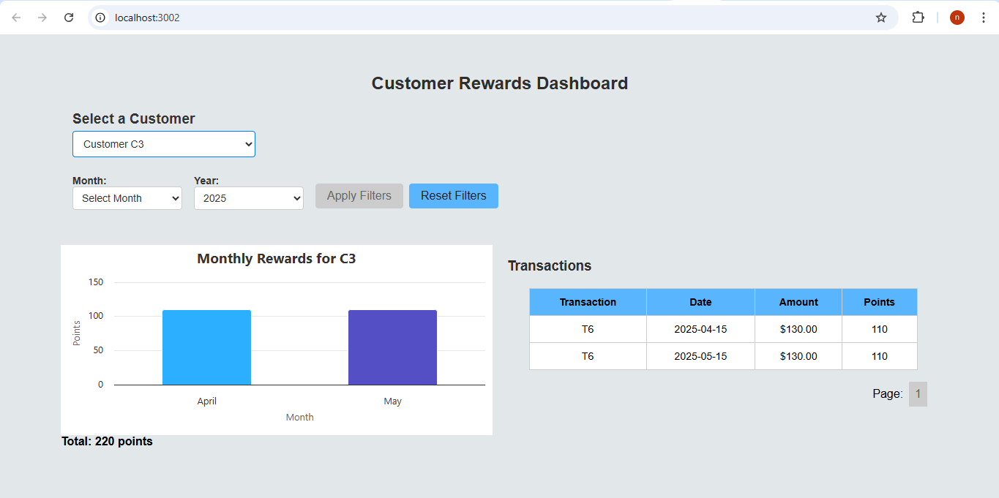
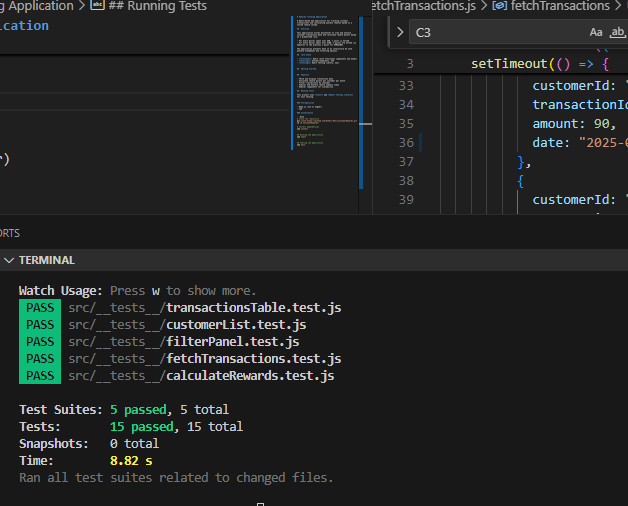

# Rewards Tracking Application

A React-based web application for tracking customer transactions and calculating monthly rewards based on a tiered reward system.

##  Overview

This application allows businesses to view and analyze customer transaction data and calculate reward points based on a predefined rule:

- For every dollar spent over $50, 1 point is earned.
- For every dollar spent over $100, 2 points are earned (in addition to the previous 1 point for $50–$100).

The application presents data in an interactive UI with monthly breakdowns and filtering options.

##  Tech Stack

- **Frontend**: React (with functional components and hooks)
- **Styling**: Styled-components, CSS
- **Testing**: React Testing Library, Jest


##  Getting Started


##  Features

- Fetch and display transaction data
- Calculate reward points per customer per month
- Filter transactions by customer
- Tabular and monthly reward summary views
- Modular components for scalability

##  Running Tests

This project uses **Jest** and **React Testing Library** for unit testing.


### Prerequisites

- Node.js (v14 or higher)
- npm 

### Installation

```bash
# Clone the repository
git clone https://github.com/Nikhil-Nati/CustomerRewards.git
cd cd CustomerRewards/

# Install dependencies
npm install


## Running the Application
npm start


## Testing the Application
npm test


```
#  Screenshots
### Initial loading

### After Loading

### After selecting customer

### Months filter

### After selecting month

### After applying filter

### Reset filters


### Test Cases
